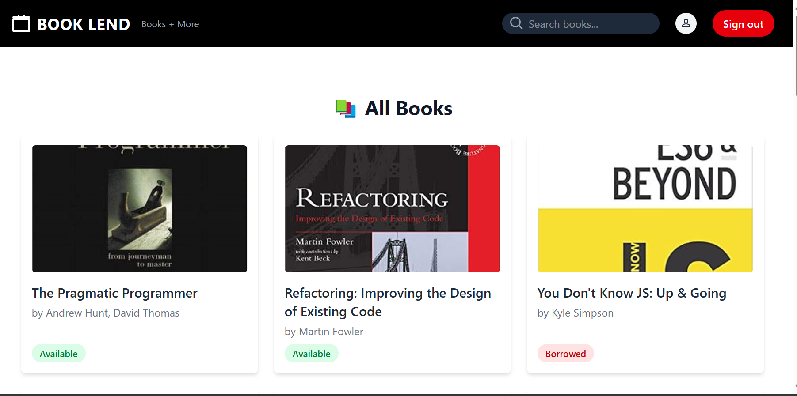

# Book Lending Library



A simple book lending library application built with  **Ruby on Rails 8** , featuring user authentication, book browsing, borrowing, and returning functionality.

## Author

**JNyaga**

## Prerequisites

Ensure you have Ruby and Rails installed on your system. Follow the official guide to set up Ruby and Rails:

[Install Ruby on Rails](https://guides.rubyonrails.org/install_ruby_on_rails.html)

## Setup Instructions

1. **Clone the Repository**

   ```sh
   git clone https://github.com/JNyaga/booklend.git
   cd booklend
   ```
2. **Install Dependencies**

   ```sh
   bin/bundle install
   ```
3. **Set Up Database**
   Run database migrations and seed initial data:

   ```sh
   bin/rails db:migrate
   bin/rails db:seed
   ```
4. **Start the Server**

   ```sh
   bin/rails server
   ```

   The application will be available at: [http://localhost:3000](http://localhost:3000/)
5. **Clear assets cache**

   ```sh
   bin/rails assets:clobber
   ```
6. **Precompile assets** (for production)

```sh
bin/rails assets:precompile
```

## Running the Application

* **Access the application:** Open your browser and go to [http://localhost:3000](http://localhost:3000/)
* **Register/Login:**
  * New users can sign up.
  * Existing users can log in.
* **Browse books:** View available books.
* **Borrow books:** Click on "Borrow" if a book is available.
* **Return books:** View borrowed books on your profile and return them.

## Running Tests

The application includes tests for models, controllers, and views. Run the tests using the Rails default testing framework:

```sh
bin/rails test
```

## Additional Commands

* **Run the Rails console:**
  ```sh
  bin/rails console
  ```
* **Rollback the last migration:**
  ```sh
  bin/rails db:rollback
  ```
* **Reset the database:**
  ```sh
  bin/rails db:reset
  ```

## Contributing

If you'd like to contribute, fork the repository and submit a pull request with your changes.

## License

This project is licensed under the MIT License.
